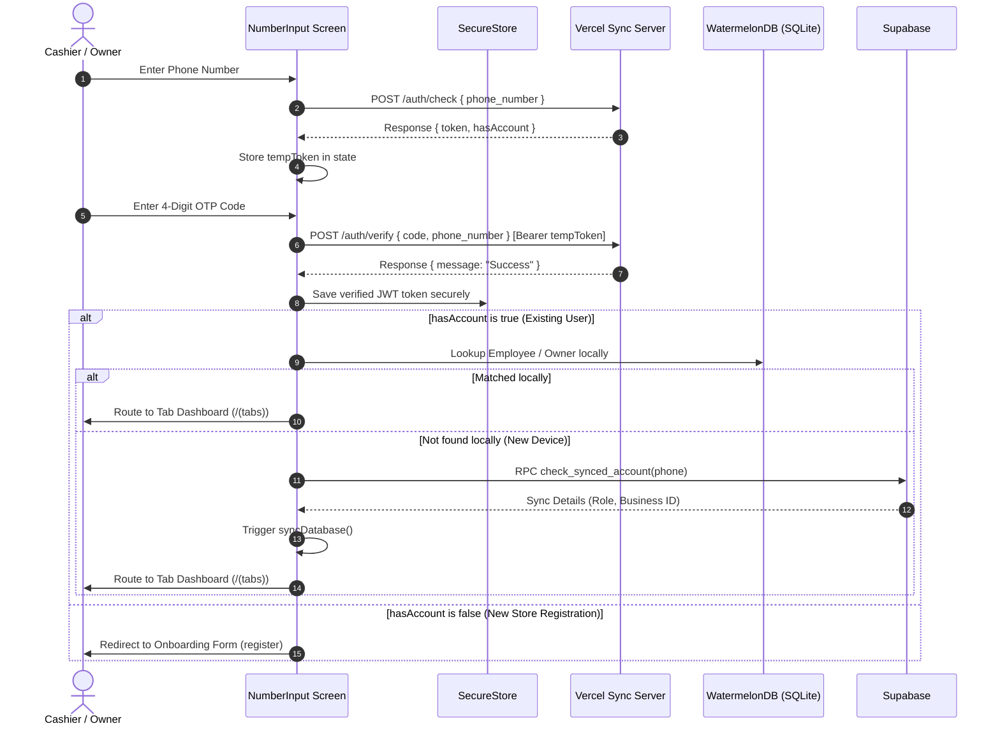

# Authentication & Security Architecture

This document describes the design, API integration, token lifecycle management, and security enforcement implemented in **Mini POS** for device authentication and remote synchronization.

---

## 1. Authentication Flow Overview

The login sequence manages device authentication, user verification, session security, and account onboarding. It interacts with the remote auth synchronization server hosted on Vercel:
`https://mini-pos-sync-server.vercel.app/api/v1/auth`



---

## 2. API Endpoint Specifications

The client interacts with the following endpoint endpoints during authentication:

### A. Phone Number Check
Checks if a normalized Sri Lankan phone number is registered on the synchronization server.
* **URL**: `POST https://mini-pos-sync-server.vercel.app/api/v1/auth/check`
* **Body**:
  ```json
  {
    "phone_number": "752925290"
  }
  ```
* **Success Response (`200 OK`)**:
  ```json
  {
    "token": "eyJ0eXAiOiJKV1QiLCJhbGciOiJIUzI1NiJ9...",
    "hasAccount": false
  }
  ```

### B. OTP Code Verification
Verifies the 4-digit code using the Bearer token returned from the check request.
* **URL**: `POST https://mini-pos-sync-server.vercel.app/api/v1/auth/verify`
* **Headers**: `Authorization: Bearer <tempToken>`
* **Body**:
  ```json
  {
    "code": "1234",
    "phone_number": "752925290"
  }
  ```
* **Success Response (`200 OK`)**:
  ```json
  {
    "message": "Success"
  }
  ```

---

## 3. Secure Storage & Token Lifecycle

Authentication session security is handled locally using hardware-level encrypted storage on the device.

### A. Secure Token Storage
Session JWT tokens are kept out of plain `AsyncStorage` and are instead stored in the hardware keychain/keystore via **[expo-secure-store](file:///Users/shenux/Desktop/Shopbook/shopbook-pos/utils/secureStorage.ts)** under the key:
`@shopbook_auth_token`

The active utility functions export:
- `saveSessionToken(token)`: Encrypts and writes the active session token.
- `getSessionToken()`: Decrypts and reads the token during startup verification.
- `deleteSessionToken()`: Clears the token upon signing out.

### B. JWT Expiry Extraction
The token expiration time (`exp`) is verified on the client by decoding the base64url payload segment natively in JavaScript:
```typescript
function base64UrlDecode(str: string): string {
  let base64 = str.replace(/-/g, "+").replace(/_/g, "/");
  while (base64.length % 4) base64 += "=";
  // Convert characters to binary string...
}
```
If the token has expired, the client automatically handles local session invalidation.

---

## 4. Lifecycle Verification & Guarding

Authentication enforcement is guarded across different entry layers:

### A. Boot Validation & Auto-Logout
On application boot, after the Zustand storage is hydrated, the root layout interceptor evaluates the secure session token in [app/_layout.tsx](file:///Users/shenux/Desktop/Shopbook/shopbook-pos/app/_layout.tsx):
```typescript
useEffect(() => {
  if (isHydrated) {
    const checkToken = async () => {
      const token = await getSessionToken();
      if (token && isTokenExpired(token)) {
        console.log("Session token expired! Triggering auto logout...");
        useAuthStore.getState().logout();
      }
    };
    checkToken().catch((err) => console.error("Error checking token expiry:", err));
  }
}, [isHydrated]);
```
If the token is expired, the system triggers `logout()`, instantly clearing local auth state caches, wiping the cart, deleting the keychain token, and routing the user to the login screen.

### B. Session Gate Route Guard
The entry screen gate [SessionGateRoute](file:///Users/shenux/Desktop/Shopbook/shopbook-pos/app/index.tsx) checks Zustand's `isLoggedIn` variable. If the token validation completes and `isLoggedIn` remains true, the user is redirected to `/(tabs)`. If `isLoggedIn` is false, they are routed to the login screen `/auth/number-input`.

### C. Manual Sign Out Cleanup
When an Admin, Manager, or Cashier chooses to sign out or switch accounts:
1. `useAuthStore.getState().logout()` (or `signOut`) is called.
2. The keychain token is deleted: `await deleteSessionToken()`.
3. All local Zustand credentials, current active branch pointers, and active order carts are wiped.
4. The client redirects to the mobile number input screen.
