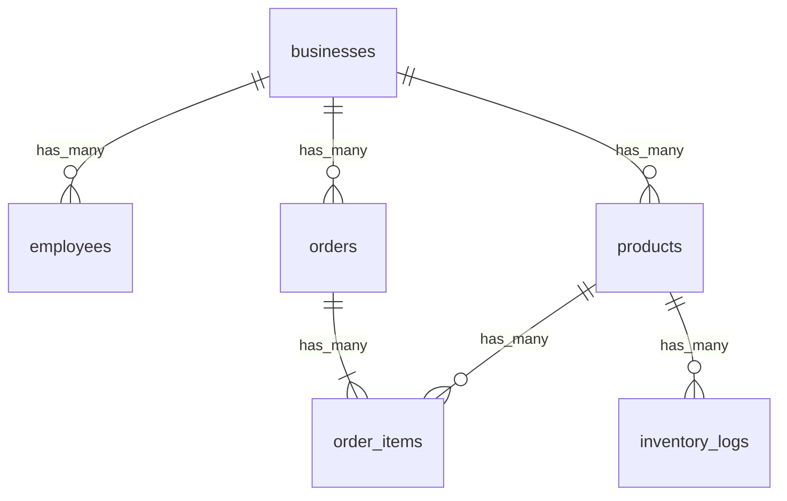

# Database Schema & Models

The Web POS terminal implements an offline-first storage model. All query operations are routed directly to an in-browser database, which syncs asynchronously with the remote Supabase database.

---

## WatermelonDB Configuration

The database architecture is defined and loaded inside:
- **Database Initializer**: [database.ts](../src/db/database.ts)
- **Database Schema**: [schema.ts](../src/db/schema.ts)
- **Database Models**: [models.ts](../src/db/models.ts)

### LokiJS Adapter
For web browsers, WatermelonDB is configured to run on top of a **LokiJS adapter** rather than SQLite. LokiJS stores the database in memory and persists serialized snapshots to IndexedDB.
```typescript
const LokiJSAdapter = require('@nozbe/watermelondb/adapters/lokijs').default;
const adapter = new LokiJSAdapter({
  schema,
  migrations,
  useWebWorker: false,
  useIncrementalIndexedDB: true, // Increases write speed on large tables
});
```

---

## Database Schema

The schema currently stands at **Version 8** and defines six core tables:

### 1. `businesses`
Stores branch configuration metadata.
- `id` (string, Primary Key)
- `name` (string)
- `business_type` (string) - Category, e.g. Grocery, Salon.
- `address` (string, optional)
- `phone_number` (string)
- `tax_id` (string, optional)
- `operating_hours` (string, optional)
- `logo_uri` (string, optional) - Public CDN link to store logo.

### 2. `employees`
Staff profiles authorized to operate terminals.
- `id` (string, Primary Key)
- `business_id` (string, Indexed) - Relationship key.
- `name` (string)
- `role` (string) - Options: `'admin' | 'manager' | 'cashier'`.
- `phone` (string) - Normal mobile number used for login checks.
- `email` (string, optional)

### 3. `products`
The items catalog.
- `id` (string, Primary Key)
- `business_id` (string, Indexed)
- `name` (string)
- `sku` (string, optional)
- `quick_code` (string, optional, Indexed) - 4-digit code for quick POS keyboard entries.
- `barcode` (string, optional, Indexed) - EAN barcode for scanner searches.
- `category` (string, optional)
- `unit_type` (string, optional) - e.g. Pieces, Bottles, Plates.
- `cost_price` (number, optional) - Merchant purchase cost.
- `price` (number) - Retail selling price.
- `stock_count` (number) - Live quantity remaining.
- `low_stock_alert` (number, optional) - Threshold for inventory warning triggers.
- `icon` (string, optional) - Product image url.
- `is_favorite` (boolean, optional) - Toggled to show in quick-favorites grid.
- `icon_pending_upload` (boolean, optional) - Track local uploads pending network restructurings.

### 4. `orders`
Header table summarizing transactions.
- `id` (string, Primary Key)
- `business_id` (string, Indexed)
- `invoice_number` (string, Indexed) - Auto-generated receipt identifier.
- `total_amount` (number) - Net total (Subtotal - Discount + Tax).
- `status` (string) - Options: `'pending' | 'paid' | 'void'`.
- `payment_method` (string, optional) - Options: `'cash' | 'card' | 'bank'`.
- `bank_name` (string, optional) - Bank name or Card brand (e.g. Visa, Sampath Bank).
- `card_last_four` (string, optional)
- `discount_type` (string, optional) - Options: `'none' | 'flat' | 'percent'`.
- `discount_value` (number, optional)
- `tax_rate` (number, optional)
- `tax_value` (number, optional)

### 5. `order_items`
Individual items added to a specific transaction.
- `id` (string, Primary Key)
- `order_id` (string, Indexed)
- `product_id` (string, Indexed, optional)
- `name` (string)
- `quantity` (number)
- `price` (number) - Retail price of the item at the time of sale.

### 6. `inventory_logs`
Historical audit trail of all manual and automated stock fluctuations.
- `id` (string, Primary Key)
- `product_id` (string, Indexed)
- `type` (string) - Options: `'in'` (restock) | `'out'` (sale, damage, etc.).
- `quantity` (number) - The volume of stock moved.
- `reason` (string, optional) - Descriptions (e.g. "Sale Checkout", "Damaged Item", "Restock").

---

## Entity Relationships & Decorators

Model relations are defined in [models.ts](../src/db/models.ts) using Watermelon decorators:



### Decorator Usage Examples:
- `@text('column')`: Maps raw database strings.
- `@field('column')`: Maps raw numbers or booleans.
- `@date('column')`: Automatically parses epoch integers into JavaScript `Date` objects.
- `@relation('table', 'column')`: Sets up lazy-loaded relationship links (returns a Watermelon `Relation` observable helper).
- `@children('table')`: Sets up one-to-many lazy query chains.

---

## Database Migrations

WatermelonDB maintains a strict schema migration history inside `src/db/migrations.ts` ([migrations.ts](../src/db/migrations.ts)). When structural changes (new columns/tables) are required:
1. Increment the database version in [schema.ts](../src/db/schema.ts#L4).
2. Add a `schemaMigration` block mapping modifications to help existing clients seamlessly transition without losing data:
```typescript
import { schemaMigrations, addColumns } from '@nozbe/watermelondb/Schema/migrations';

export default schemaMigrations({
  migrations: [
    {
      toVersion: 8,
      steps: [
        addColumns({
          table: 'products',
          columns: [
            { name: 'icon_pending_upload', type: 'boolean', isOptional: true },
          ],
        }),
      ],
    },
  ],
});
```

---

## Initial Catalog Seeding

When a store registers for the first time, the local database catalog is seeded with standard products (pizzas, salads, wraps) to provide placeholder catalog data for demonstration:
- **Seed Trigger**: Triggered inside [businessStore.ts](../src/stores/businessStore.ts#L173-L194) upon the very first store registration if the local products table is empty.
- **Seeded Items List**: Configured in [seedProducts.ts](../src/utils/seedProducts.ts), mapping item categories, pricing, unit types, cost prices, and quick codes.
